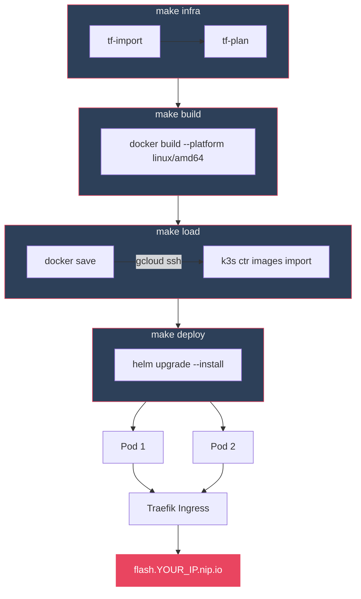
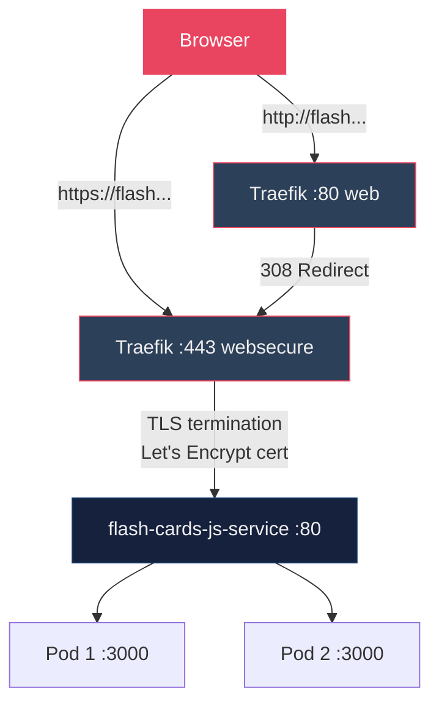

# ⚡ Flash Cards App

Learn German, Kubernetes, or any subject with flip cards. Runs in Docker, deploys to k3s on GCP.

## Pipeline



## Quick Start

```bash
# Docker
docker build -t flash-cards-js .
docker run -p 3000:3000 flash-cards-js

# Or without Docker
npm install
npm start
```

Open http://localhost:3000

## Deploy to k3s on GCP

### Full pipeline

```bash
make all
```

This runs `infra` → `build` → `load` → `deploy` in sequence.

### Step by step

```bash
# 1. Import Terraform state from sibling project + verify no drift
make infra

# 2. Build Docker image (cross-compiled for linux/amd64)
make build

# 3. Load image directly into k3s node (no registry needed)
#    docker save | gcloud compute ssh k3s-node | k3s ctr images import
make load

# 4. Deploy 2 replicas via Helm with GCP values
make deploy
```

### Working example

```
$ make build
docker build --platform linux/amd64 -t flash-cards-js:latest .
#8 [4/7] RUN npm ci --omit=dev
#8 added 68 packages in 1s
#13 naming to docker.io/library/flash-cards-js:latest done

$ make load
docker save flash-cards-js:latest | gcloud compute ssh k3s-node --zone=us-east1-b \
  --command="sudo k3s ctr images import -"
docker.io/library/flash-cards-js:latest   saved
Importing  elapsed: 17.4s

$ make deploy
helm upgrade --install flash-cards-js ./helm/flash-cards-js \
  -f ./helm/flash-cards-js/values-gcp.yaml \
  --set image.repository=flash-cards-js \
  --set image.tag=latest
NAME: flash-cards-js
STATUS: deployed
REVISION: 1

$ kubectl get pods -l app=flash-cards-js
NAME                                         READY   STATUS    AGE
flash-cards-js-deployment-74f6b6d956-gn6q4   1/1     Running   17s
flash-cards-js-deployment-74f6b6d956-mmdgl   1/1     Running   17s

$ curl -s https://flash.YOUR_IP.nip.io/api/decks | python3 -m json.tool
[
    {
        "id": "eks-2026-03-31",
        "slug": "eks",
        "name": "EKS & Kubernetes (2026-03-31)",
        "count": 127
    },
    {
        "id": "german-2026-03-31",
        "slug": "german",
        "name": "German (2026-03-31)",
        "count": 100
    }
]
```

### All Makefile targets

```
$ make help
  help         Show this help
  tf-init      Initialize Terraform
  tf-import    Import existing GCP state
  tf-plan      Run Terraform plan
  infra        Import state + verify (no changes expected)
  build        Build Docker image (linux/amd64 for k3s)
  load         Build and load image into k3s node
  deploy       Deploy to k3s with Helm
  all          Full pipeline: infra, build, load, deploy
  clean        Remove local Docker image
```

## How It Works

The app is an Express server that reads JSON deck files from `decks/` at request time and serves them to a vanilla JS frontend with interactive flip cards.

- `server.js` — Express server with health check, deck API, and slug-based routing
- `public/deck.html` — Self-contained frontend (HTML + CSS + JS, no build step)
- `decks/*.json` — Card data; drop in a new file and it appears automatically

### URL Routing

Each deck gets its own URL based on the filename (date suffix stripped):

| URL | Deck |
|-----|------|
| http://flash.YOUR_IP.nip.io/ | Index page with links to all decks |
| http://flash.YOUR_IP.nip.io/eks | EKS & Kubernetes (127 cards) |
| http://flash.YOUR_IP.nip.io/german | German (100 cards) |

### API

| Endpoint | Description |
|---|---|
| `GET /api/decks` | Lists all decks with id, slug, name, and card count |
| `GET /api/decks/:id` | Returns a single deck with a flat `cards` array |
| `GET /healthz` | Health check (returns `ok`) |

The server normalizes both deck formats (flat and sectioned) into a flat `cards` array before sending to the frontend. This means the frontend doesn't need to know about sections — it just iterates over cards.

### Frontend Controls

- Click the card or press **Space** to flip
- **← / →** arrow keys or buttons to navigate
- **🔀 Shuffle** randomizes the current deck
- **🔊 Speak** or press **Enter** — text-to-speech (German deck: `de-DE` on front, `en-US` on back)

For sectioned decks, the section name and card number appear below the term (e.g. `Verben #36`).

## Deck Formats

Decks are JSON files in `decks/`. Drop in a new file and it appears automatically — no restart needed since the server reads the directory on each request.

### Flat format (simple)

Best for decks without categories:

```json
{
  "name": "EKS & Kubernetes (2026-03-31)",
  "cards": [
    { "front": "What is a Pod?", "back": "Smallest deployable unit in k8s" }
  ]
}
```

### Sectioned format (with numbering)

Groups cards into named sections with original numbering:

```json
{
  "name": "German (2026-03-31)",
  "sections": [
    {
      "name": "Verben",
      "cards": [
        { "num": 31, "front": "sein", "back": "to be" },
        { "num": 32, "front": "haben", "back": "to have" }
      ]
    }
  ]
}
```

When a sectioned deck is loaded, the server's `flattenCards` helper merges all sections into a single `cards` array and attaches the `section` name to each card.

## Project Structure

```
flash-cards-js/
├── server.js              # Express server + API + slug routing
├── public/deck.html       # Frontend (flip card UI + text-to-speech)
├── decks/                 # Card decks (JSON)
│   ├── eks-2026-03-31.json      # Sectioned (127 cards, 10 sections)
│   └── german-2026-03-31.json   # Sectioned (100 cards, 9 sections)
├── Dockerfile             # Node 22 Alpine, explicit COPY targets
├── package.json           # express dependency
├── Makefile               # Pipeline: infra → build → load → deploy
├── helm/flash-cards-js/   # Helm chart for k3s deployment
│   ├── Chart.yaml
│   ├── values.yaml        # Default values (security context, probes, resources)
│   ├── values-gcp.yaml    # GCP overrides (ingress host, 2 replicas)
│   └── templates/
│       ├── deployment.yaml
│       ├── service.yaml
│       ├── ingress.yaml
│       └── redirect.yaml
└── terraform/gcp/         # GCP infrastructure (shared with k3s-gitlabci-golang-demo)
    ├── main.tf            # e2-small VM, firewall rules
    ├── variables.tf       # project, region, zone
    ├── outputs.tf         # external IP, SSH command, deploy command
    └── import-state.sh    # Copies tfstate from k3s-gitlabci-golang-demo
```

## Infrastructure

### GCP Resources

Terraform manages a single GCP Compute Engine VM running k3s. The infrastructure is shared with the [k3s-gitlabci-golang-demo](../k3s-gitlabci-golang-demo) project — both apps run on the same k3s cluster.

| Resource | Name | Purpose |
|----------|------|---------|
| Compute Instance | `k3s-node` | e2-small, Ubuntu 24.04, k3s single-node cluster |
| Firewall | `allow-http-https` | Ports 80, 443 |
| Firewall | `allow-k3s-api` | Port 6443 (K8s API) |
| Firewall | `allow-ssh` | Port 22 |
| Firewall | `allow-nodeports` | Ports 30000-32767 |

### Importing State

Since the k3s node already exists, the terraform state is imported directly from GCP rather than creating new resources:

```bash
make infra
```

This runs `import-state.sh` (imports each GCP resource via `terraform import`) then `terraform plan` to verify no drift. Safe to run multiple times — already-imported resources are skipped.

### Kubeconfig

Fetch the kubeconfig from the k3s node and replace `127.0.0.1` with the external IP:

```bash
gcloud compute ssh k3s-node --zone=us-east1-b \
  --command="sudo cat /etc/rancher/k3s/k3s.yaml" | \
  sed 's/127.0.0.1/YOUR_IP/' > ~/.kube/k3s-gcp.yaml
```

Then export it before running `kubectl` or `helm`:

```bash
export KUBECONFIG=~/.kube/k3s-gcp.yaml
kubectl get nodes
```

## Kubernetes Deployment

The Helm chart deploys 2 replicas behind a ClusterIP Service with Traefik ingress on `flash.YOUR_IP.nip.io`. HTTPS is provided by Let's Encrypt (auto-renewed via Traefik ACME), and HTTP requests are permanently redirected to HTTPS.



### Security Hardening

| Feature | Value |
|---------|-------|
| Non-root user | UID 1000 |
| Read-only root filesystem | ✅ |
| Dropped capabilities | ALL |
| Privilege escalation | Disabled |
| Seccomp profile | RuntimeDefault |
| Resource limits | 200m CPU / 128Mi memory |
| Liveness probe | `GET /healthz` every 10s |
| HTTPS (Let's Encrypt) | ✅ (auto-renewed via Traefik ACME) |
| HTTP → HTTPS redirect | 308 Permanent Redirect |

Verify the certificate:

```bash
$ echo | openssl s_client -connect flash.YOUR_IP.nip.io:443 \
    -servername flash.YOUR_IP.nip.io 2>/dev/null | \
    openssl x509 -noout -subject -issuer -dates
subject= /CN=flash.YOUR_IP.nip.io
issuer= /C=US/O=Let's Encrypt/CN=R12
notBefore=Apr  1 00:41:30 2026 GMT
notAfter=Jun 30 00:41:29 2026 GMT
```

### Docker Image

Node 22 Alpine, runs as the built-in `node` user (non-root). Explicit COPY targets for better layer caching and smaller attack surface:

```dockerfile
FROM node:22-alpine
WORKDIR /app
COPY package.json package-lock.json ./
RUN npm ci --omit=dev
COPY server.js ./
COPY public/ public/
COPY decks/ decks/
EXPOSE 3000
USER node
CMD ["node", "server.js"]
```

### Access Logs

Traefik access logs are enabled via a `HelmChartConfig` on the k3s node at `/var/lib/rancher/k3s/server/manifests/traefik-config.yaml`:

```yaml
apiVersion: helm.cattle.io/v1
kind: HelmChartConfig
metadata:
  name: traefik
  namespace: kube-system
spec:
  valuesContent: |-
    logs:
      access:
        enabled: true
    additionalArguments:
      - "--certificatesresolvers.letsencrypt.acme.email=<your-email>"
      - "--certificatesresolvers.letsencrypt.acme.storage=/data/acme.json"
      - "--certificatesresolvers.letsencrypt.acme.httpchallenge.entrypoint=web"
    persistence:
      enabled: true
      size: 128Mi
      path: /data
    service:
      spec:
        externalTrafficPolicy: Local
```

`externalTrafficPolicy: Local` preserves real client IPs in the logs. Without it, all requests show the internal k3s gateway IP (`10.42.0.1`).

View logs:

```bash
export KUBECONFIG=~/.kube/k3s-gcp.yaml

# Live tail
kubectl logs -n kube-system -l app.kubernetes.io/name=traefik -f

# Last 50 lines
kubectl logs -n kube-system -l app.kubernetes.io/name=traefik --tail=50
```

Example output:

```
10.42.0.1 - - [01/Apr/2026:01:25:41 +0000] "GET /healthz HTTP/1.1" 200 2 "-" "-" 1 "default-flash-cards-js-flash-34-26-196-176-nip-io@kubernetes" "http://10.42.0.78:3000" 2ms
10.42.0.1 - - [01/Apr/2026:01:25:41 +0000] "GET /eks HTTP/1.1" 200 4729 "-" "-" 2 "default-flash-cards-js-flash-34-26-196-176-nip-io@kubernetes" "http://10.42.0.77:3000" 373ms
```

Each line shows: client IP, timestamp, method, path, status, size, matched ingress route, backend Pod, and response time.

### Why a Makefile?

The sibling projects use full CI/CD pipelines (GitLab CI for the golang demo, CircleCI for the rust demo). This project uses a Makefile instead because:

- No CI/CD platform configured yet — the Makefile provides the same terraform → build → deploy workflow locally
- Single dependency (make), no agents or runners needed
- No registry needed — images are loaded directly into the k3s node via `docker save | k3s ctr images import`
- Easy to wrap into any CI system later — each target maps to a pipeline step

## Related Projects

| Project | CI/CD | Language | URL |
|---------|-------|----------|-----|
| [k3s-gitlabci-golang-demo](../k3s-gitlabci-golang-demo) | GitLab CI | Go | http://YOUR_IP |
| [k3s-circleci-rust-demo](../k3s-circleci-rust-demo) | CircleCI | Rust | http://YOUR_IP/rust |
| **k3s-flash-cards-js** (this) | Makefile | Node.js | https://flash.YOUR_IP.nip.io |

All three deploy to the same k3s cluster on GCP (`e2-small` in `us-east1-b`).
